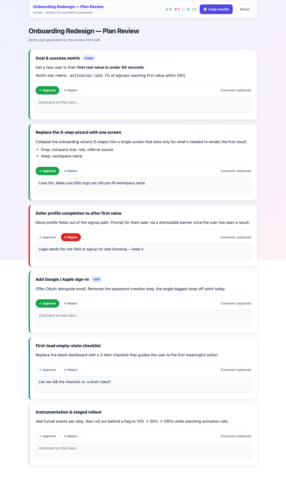

# review-html

<p align="center">
  
</p>

A Claude Code [skill](https://code.claude.com/docs/en/skills) that turns any
content — a plan, doc, code, or spec — into a single HTML file you can review
inline.

Instead of writing "in section 3, change X" back to the agent, you approve,
reject, or comment **right on top of each item**, then copy the whole verdict out
as Markdown and paste it back. No referencing, no line numbers.

It's one self-contained file: no build, no server, no dependencies. Open it from
`file://`, and your decisions persist in `localStorage`.

## Install

Drop the repo in your skills directory so the folder name matches the skill name:

```bash
git clone https://github.com/esc5221/review-html ~/.claude/skills/review-html
```

Picked up the next time Claude Code starts.

## Use

Ask in plain language:

> Turn this plan into a review HTML so I can approve/reject and comment per item.

The skill fills `assets/template.html` and writes the finished file. See
[`SKILL.md`](./SKILL.md) for the authoring contract.

## License

[MIT](./LICENSE)
